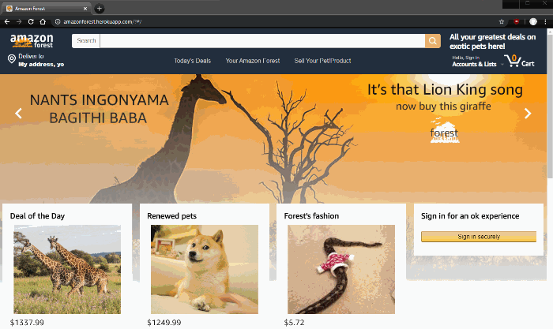

# AmazonForest

#### A fun Amazon-inspired shopping site for exotic animals. A user can browse by category, search for products, add products to their cart, review/comment/rate a product, and even create a new product.


[Demo](https://amazonforest.herokuapp.com/#/login)

<!-- ## Background and Overview
## Functionality and MVP
- [ ] Product Listings
- [ ] Shopping Cart
- [ ] Comments / Reviews
- [ ] Search
- [ ] Bonus: Categories
- [ ] Bonus: Wish Lists -->


## Technologies	
  * MongoDB
  * Express 
  * React
  * Node.js
  * Redux
  * AWS
  * Webpack
  * Heroku

## Features:
### Will Look good in any screen size, including mobile!


Each of our group members had different sized screen so media queries had to be used.

```css
@media only screen and (max-width: 1280px) {
  .headerTop span{
    display: none;
  }

  .home-page-entire-row {
    top: -470px;
    max-width: 98vw;
    margin-left: -1px;
}

@media only screen and (max-width: 805px) {
  .item-lists {
       flex-direction: column;
  }
}
```
Multiple media selectors were made for low resolution desktops and mobile devices. Some elements were hidden and their flex direction and wrapping changed to accomodate a portrait orientation.  

### A robust search component 


Upon typing in the search bar, suggestions are immidiately generated. A previous query for the items are recycled and are filtered using RegExp to match the search term.

```javaScript
onInputChange(e){
    this.suggestionsElement.classList.add("active")
    let newDisplayed = this.props.items.filter(item => item.title.match(new RegExp( e.target.value, "i")))
    this.setState({
        searchTerm: e.target.value,
        currentlyDisplayed: newDisplayed
    })
}
```

Pressing enter sends the user to a search page where they can filter by category. 

```javaScript
filterPets(key) {
    let category
    if (key === "pets") category = "category1"
    if (key === "accessories") category = "accessories"
    if (key === "food") category = "category5"
    if (key === "toys") category = key
    let filtered = this.state.items.filter(item => item.category == category)
    this.setState({ filtered: filtered })
}
```

<!-- ## Group Members and Work Breakdown
backend: Brock & Abby
Frontend: Brett && Carlos
### Day 1 - 2
* User Auth
* MongoDb Setup
* React Skeleton
* models (items, users(seller, buyer), comments, reviews, categories, cart_items, wish_lists)

### Day 3 - 5
* Home Page (item index)
* Profile Page (user show)
    - orders page
    - profile page
* Item detail (show)
#### Bonus:
* Categories (catagories index)

### Day 5 - 7
* Search Page
* Shopping Cart
* Checkout


## Plan for getting users and reviews (if your app is a downloadable app) -->
